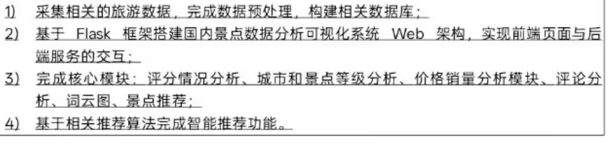
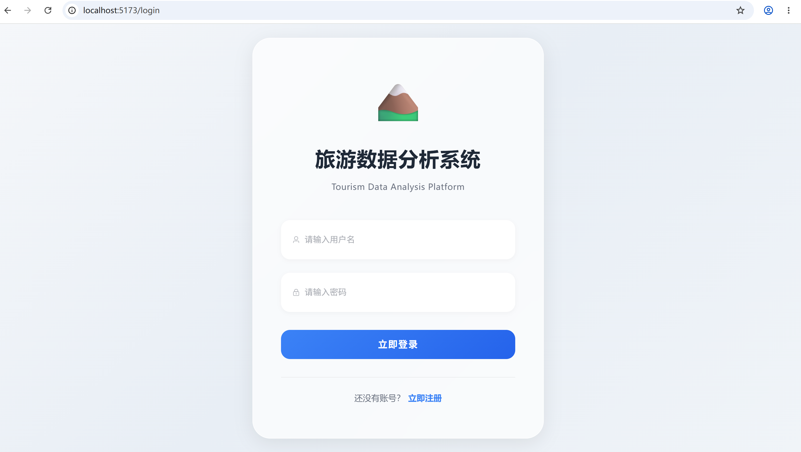
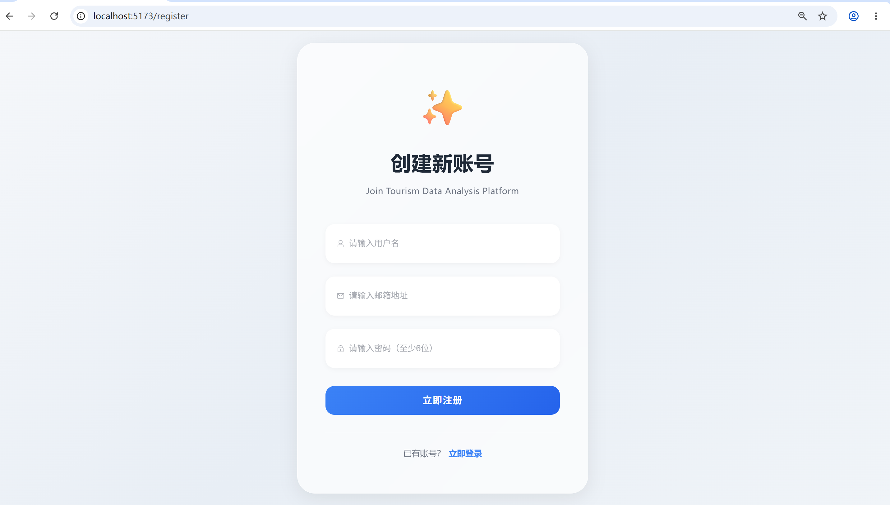
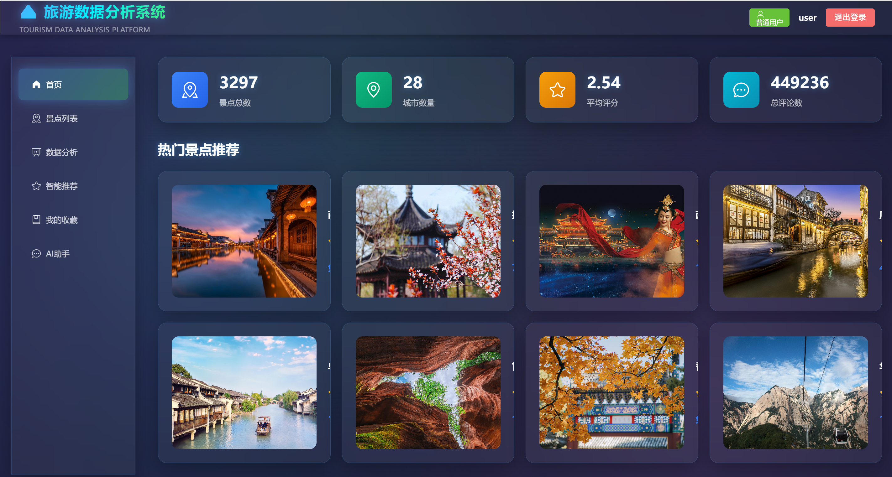
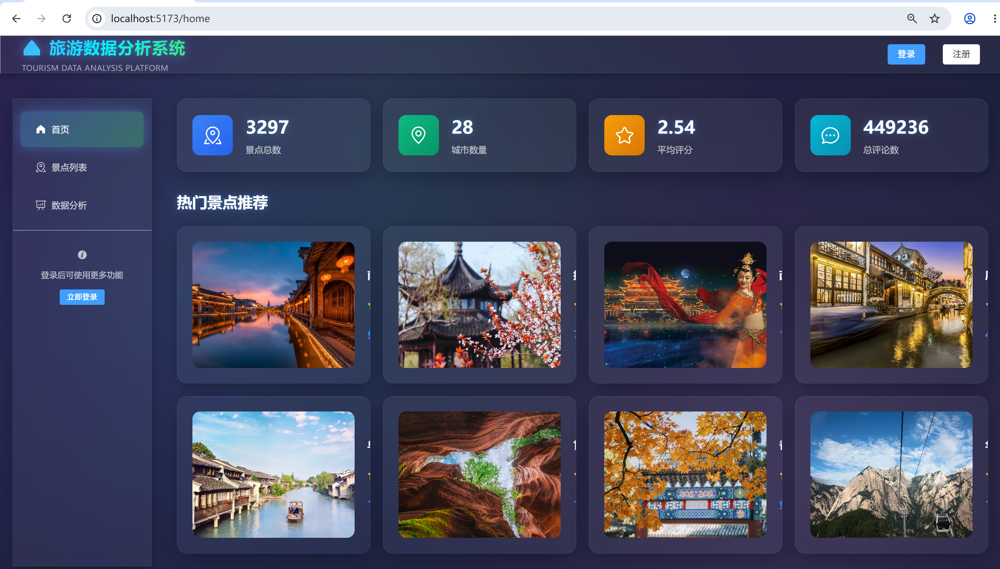
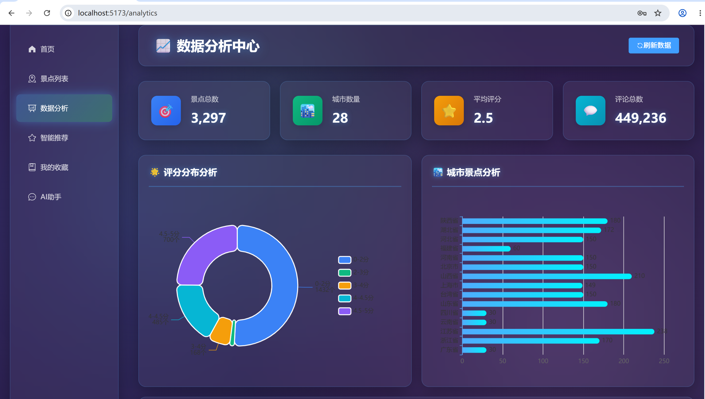
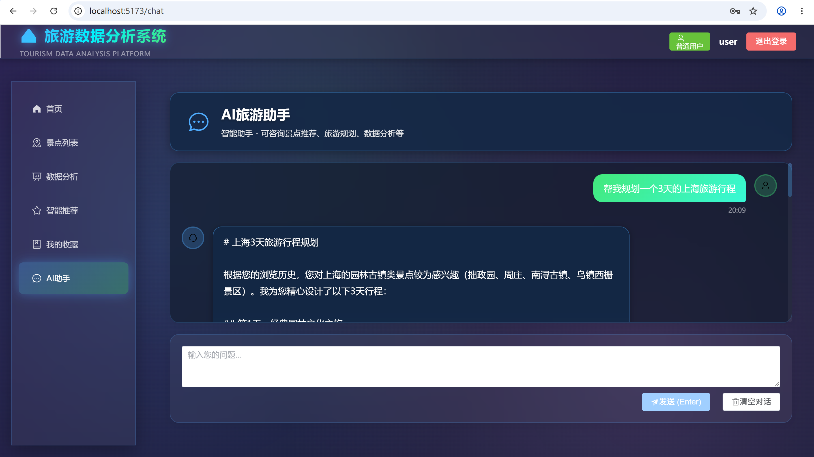
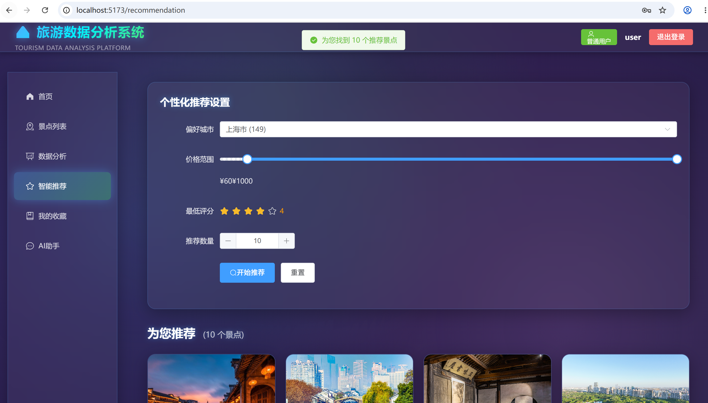
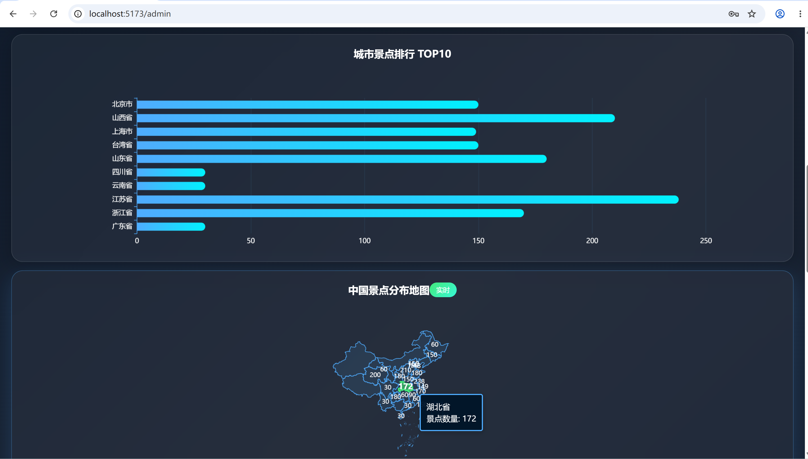

# 基于Python的旅游数据分析可视化推荐系统

## 项目简介

这是一个基于Flask + Vue3的旅游数据分析可视化推荐系统，实现了景点数据采集、分析、可视化和智能推荐功能。

根据上面图片与客户交流后得到用户需求分析
## 用户需求分析
本系统面向**普通游客用户**与**旅游行业管理员**两类用户，两类用户需求如下。
## 3.1 用户需求
### 1. 用户
游客作为系统前台使用者，核心诉求是快速获取景点信息，辅助旅游决策。需要支持景点多条件检索，查看景点基础资料与游客评论；通过可视化图表直观了解不同地区景点的分布、评分、价格情况；获取个性化景点推荐，降低信息筛选成本。
### 2. 管理员
管理员使用系统后台，用于旅游资源数据分析与管理。需要完成旅游景点数据采集、清洗与入库；查看多维度统计可视化图表，包括省份统计、评分分布、价格销量、评论词云等；管理系统账号与景点基础数据；同时系统具备良好的并发能力，支持多人访问。
## 3.2 功能需求
1. **数据采集与预处理模块**：用户需要真实的数据，通过收集我们知道携程上面有很多真实的旅游数据，所以可以通过爬虫 / 公开 API 采集景点数据，但是要注意每次爬取的数据量和频率防止暴力爬取遭到反爬，使用 Pandas 完成数据清洗、缺失值填充、特征提取，存入 MySQL 数据库。
2. **用户权限模块**：实现用户注册、登录，区分普通游客与管理员角色。
3. **景点查询模块**：按省份、城市、景点等级筛选查询景点详情。
4. **可视化分析模块**：实现省份景点统计、评分分布分析、价格销量分析、城市分布热力图、评论词云等可视化图表。
5. **景点推荐模块**：基于推荐算法实现景点个性化推荐。

## 技术栈

### 后端
- Flask 3.0 - Web框架
- MySQL - 数据存储
- Redis - 缓存
- MinIO - 对象存储（文件/图片）
- SQLAlchemy - ORM
- APScheduler - 定时任务
- DeepSeek API - 智能推荐分析
- BigModel API - 旅游规划生成
- aiohttp - 异步协程爬虫

### 前端
- Vue 3 - 前端框架
- Element Plus - UI组件库
- ECharts - 数据可视化
- Vue Router - 路由管理
- Pinia - 状态管理
- Axios - HTTP客户端

## 功能模块

### 1. 数据采集模块（严格遵守君子协议）
- 异步协程爬虫采集携程景点数据
- **首次启动**：数据库为空时，随机选16个城市，每个爬15页（页码随机1-300）
- **定时任务**：每5分钟随机爬取约30条数据（3页×10条）
- **每天最多20次**：保护目标服务器，不嚣张
- **当天城市不重复**：已爬过的城市当天不再爬取
- **智能去重**：
  - 数据一模一样 → 跳过
  - 有部分变化 → 更新
  - 完全不同 → 插入
- **请求延迟**：每次请求间隔1-3秒

### 2. 数据分析模块
- 评分情况分析
- 城市和景点等级分析
- 价格销量分析
- 标签词云分析
- 数据概览统计

### 3. 智能推荐模块
- 基于DeepSeek的个性化推荐
- 基于BigModel的旅游规划生成
- 相似景点推荐
- 热门景点推荐

### 4. 用户功能
- 用户注册/登录
- 景点浏览历史
- 景点收藏
- 个性化推荐

### 5. 管理员功能
- 用户管理
- 景点管理
- 爬虫任务监控
- 系统日志查看
- 数据统计

## 安装部署

### 1. 环境要求
- Python 3.8+
- Node.js 16+
- MySQL 8.0+
- Redis 6.0+
- MinIO（已配置）

### 2. 数据库初始化

```bash
# 登录MySQL
mysql -u root -p

# 执行初始化脚本
source lybackend/init.sql
```

### 3. 后端部署

```bash
cd lybackend

# 安装依赖
pip install -r requirements.txt

# 启动应用
python app.py
```

后端将运行在 http://localhost:5000

### 4. 前端部署

```bash
cd frontend

# 安装依赖
npm install

# 启动开发服务器
npm run dev
```

前端将运行在 http://localhost:5173

## 配置说明

### 数据库配置
在 `lybackend/config.py` 中修改：
```python
MYSQL_USER = 'root'
MYSQL_PASSWORD = '123456'
MYSQL_DB = 'tourism_system'
```

### Redis配置
```python
REDIS_HOST = 'localhost'
REDIS_PORT = 6379
```

### AI API配置
- DeepSeek API Key: 已配置
- BigModel API Key: 已配置

## 默认账户

### 管理员账户
- 用户名: admin
- 密码: admin123

### 测试用户
- 用户名: testuser
- 密码: user123

## 项目结构

```
.
├── lybackend/              # 后端目录
│   ├── app.py             # Flask应用入口
│   ├── config.py          # 配置文件
│   ├── models.py          # 数据模型
│   ├── init.sql           # 数据库初始化脚本
│   ├── requirements.txt   # Python依赖
│   ├── data/              # 数据采集
│   │   ├── spider.py      # 原始爬虫脚本
│   │   └── data_pro.py    # 数据处理
│   ├── routes/            # 路由模块
│   │   ├── auth.py        # 认证路由
│   │   ├── attractions.py # 景点路由
│   │   ├── analytics.py   # 分析路由
│   │   ├── recommendation.py # 推荐路由
│   │   ├── admin.py       # 管理路由
│   │   └── upload.py      # 文件上传路由
│   └── utils/             # 工具模块
│       ├── ai_service.py  # AI服务
│       ├── redis_client.py # Redis客户端
│       ├── minio_client.py # MinIO客户端
│       └── spider_scheduler.py # 爬虫调度器（君子协议）
│
└── frontend/              # 前端目录
    ├── src/
    │   ├── api/           # API接口
    │   ├── stores/        # 状态管理
    │   ├── router/        # 路由配置
    │   ├── views/         # 页面组件
    │   ├── App.vue        # 根组件
    │   └── main.js        # 入口文件
    └── package.json       # 前端依赖
```

## 项目展示
1.登录页面

2.注册页面

3.登录状态下的首页

4.未登录状态下的首页

5.数据分析页

6.AI旅游推荐助手

7.智能推荐页

8.景点的排行榜分布图

## 设计特点

### UI设计
- 采用磨砂玻璃效果（glass-effect）
- 清爽的卡片设计
- 渐变色主题（紫色系）
- 响应式布局

### 数据保护
- 爬虫限流机制
- 随机延迟请求
- 每日任务上限
- 避免重复爬取

### 性能优化
- Redis缓存热点数据
- 数据库索引优化
- 异步爬虫提升效率
- 前端路由懒加载

## 开发说明

### 添加新的分析模块
1. 在 `lybackend/routes/analytics.py` 添加路由
2. 在前端创建对应的视图组件
3. 使用ECharts进行数据可视化

### 扩展AI功能
1. 在 `lybackend/utils/ai_service.py` 添加新方法
2. 调用DeepSeek或BigModel API
3. 在路由中调用AI服务

## 注意事项

1. **首次启动**：如果数据库为空，会自动爬取数据（5-10分钟）
2. **服务依赖**：确保MySQL、Redis和MinIO服务已启动
3. **爬虫规则**：严格遵守君子协议
   - 每天最多20次爬取
   - 请求间隔1-3秒
   - 智能去重，避免重复数据
   - 当天城市不重复爬取
4. **AI功能**：需要网络连接，API Key已内置
5. **生产环境**：请修改SECRET_KEY和数据库密码
6. **法律合规**：爬虫请遵守robots.txt和相关法律法规


## 许可证

MIT License
